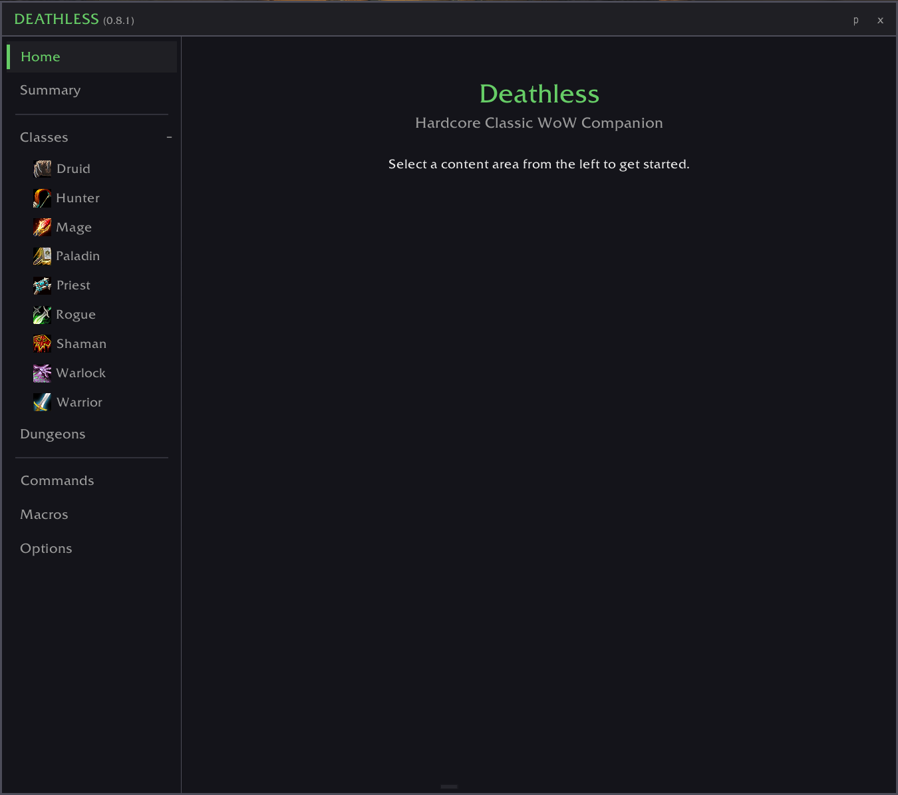
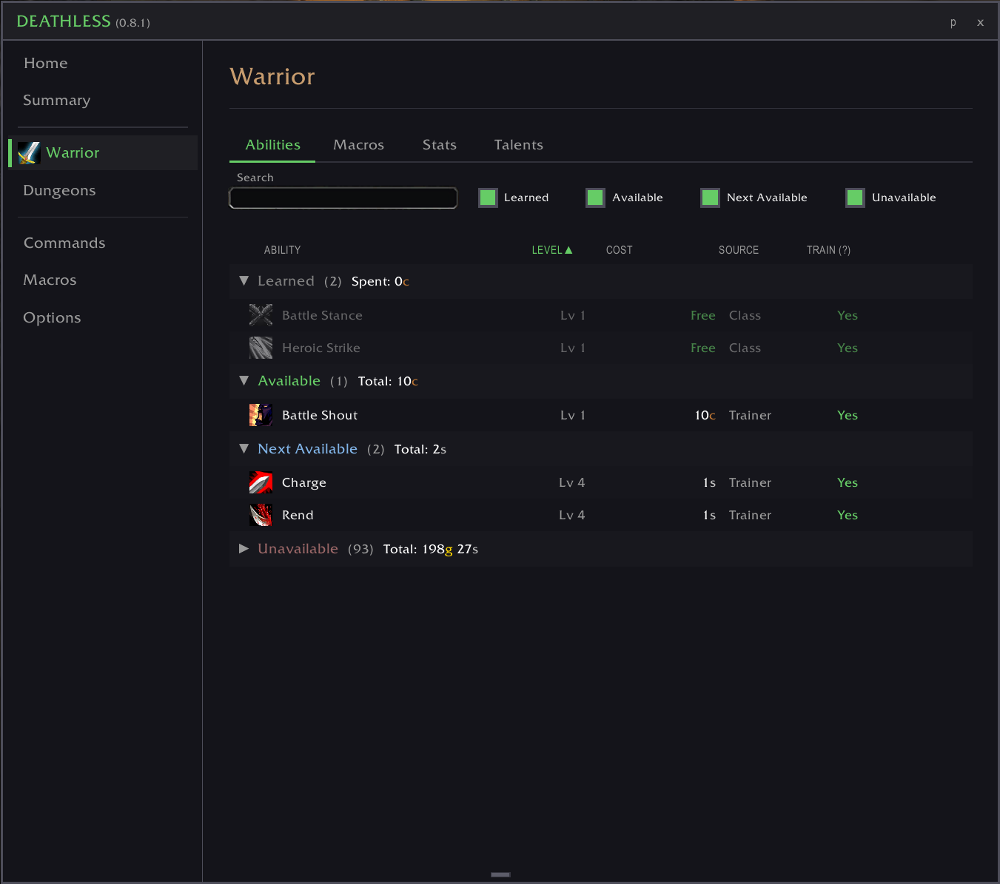
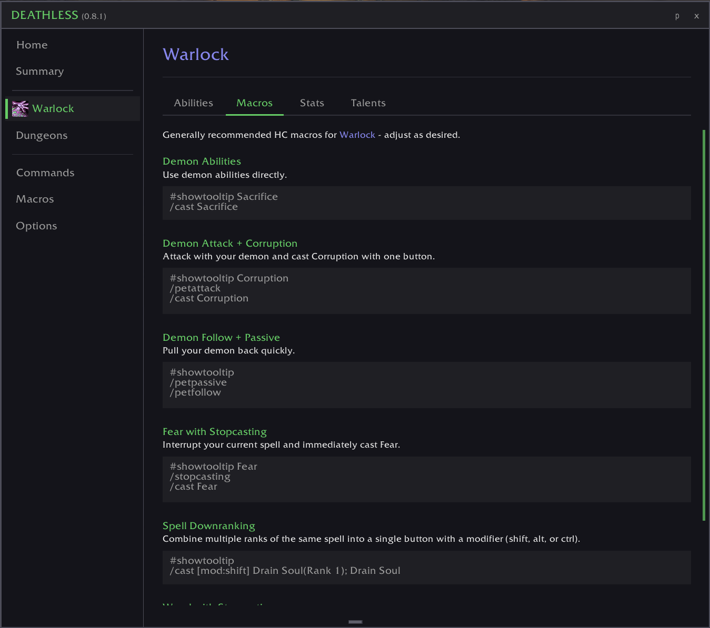
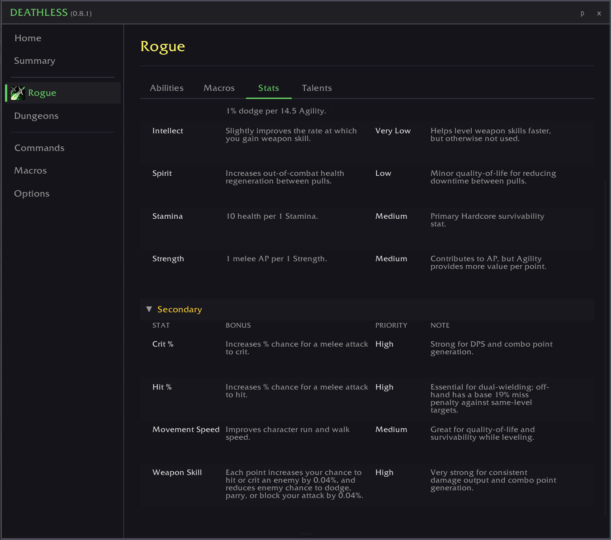
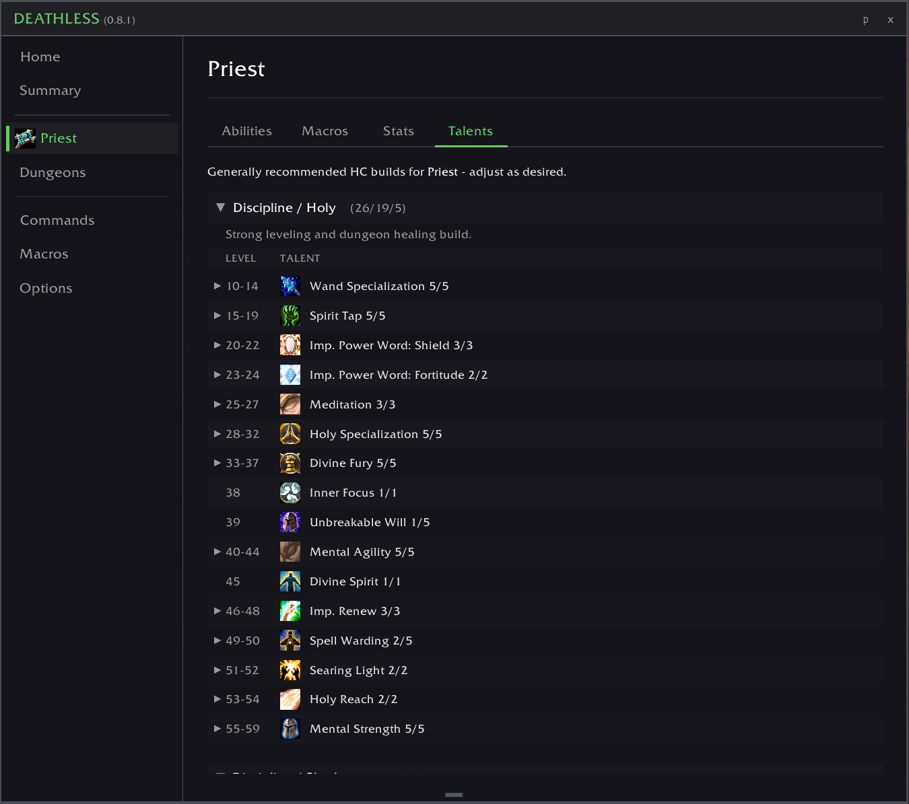
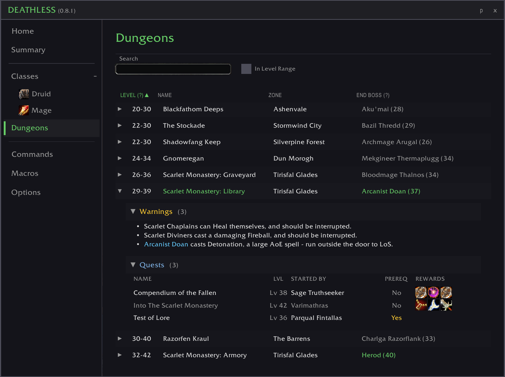
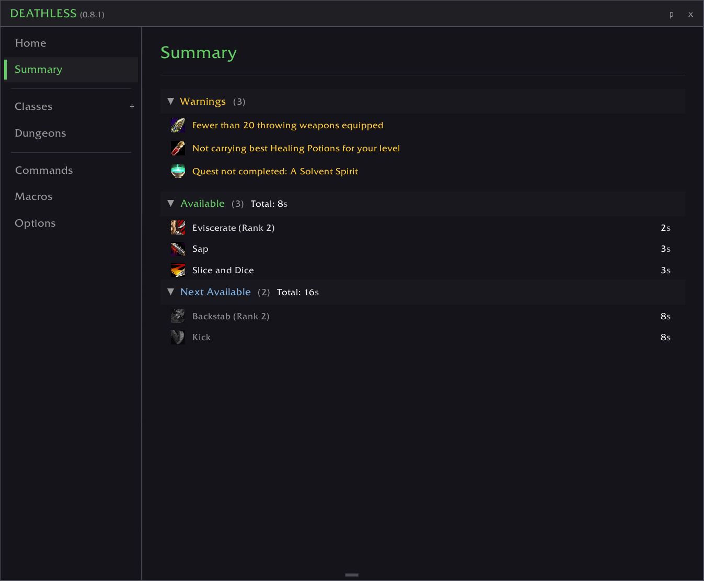
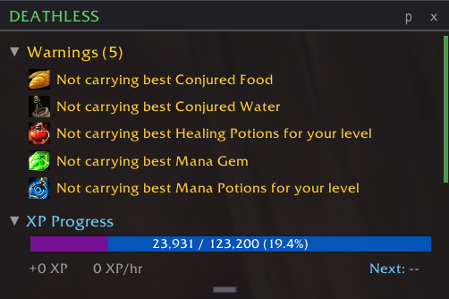

# deathless

## Overview

A Hardcore Classic WoW addon.

`deathless` is a multi-purpose / all-in-one companion addon for the HC player on their 1-60 journey. 

It tries to provide recommendations and guidance to the player by being opinionated but not obnoxious or unnecessarily prescriptive.

### Key Capabilities

- Class guides, ability lists, talent builds, and class-specific macros
- Dungeon guides and quest rewards
- Warnings for things such as: missing important items, unspent talent points, uncompleted important HC quests, and under-leveled consumables.
- General-purpose Hardcore macros

## Installation

Install via [CurseForge](https://www.curseforge.com/wow/addons), [Wago](https://addons.wago.io/), or [WoWInterface](https://www.wowinterface.com/). You can also manually copy the addon folder to your `Interface\AddOns\` directory.

## Usage

Open the addon in-game with `/deathless` or `/dls`. Run `/dls h` for all available commands.

## Features 

### Detailed Class Information

#### Abilities

- Shows Abilities for each class: Learned, Available, Next Available, and Unavailable.
- Includes level available, price, source, and a recommendation as to train, wait to train, or not train each ability.

#### Macros

- Commonly used macros and macro-patterns for each class.

#### Stats

- Bonuses provided per point of primary stat for each class.
- Stat priority guidance for each class.

#### Talents

- Shows one or more generally viable HC leveling talent trees for each class.

### Detailed Dungeon Information

- Shows overview of all dungeons and their appropriate level ranges.
- Allows filtering to only show dungeons for the current character level.
- For each dungeon, provides a brief Warnings section for notable dangers.
- For each dungeon, provides a full list of available quests, and their rewards.

### Summary Tab / Mini Viewer

- Displays dynamic Warnings to the player for things like: missing consumables, unspent Talent points, or under-leveled First Aid.
- Available in the `Summary` tab in the main addon, or as a mini viewer.

